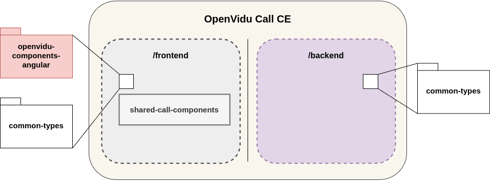

[](http://www.apache.org/licenses/LICENSE-2.0)

# OpenVidu Call

OpenVidu Call is a versatile video conferencing application powered by **OpenVidu**, designed to support a wide range of use cases, from personal video calls to professional webinars. Built with **Angular**, OpenVidu Call offers two distinct modes of operation to cater to both non-technical users and developers seeking deep integration with their applications.

## Modes of Use

### Full Mode

**For non-developers and quick deployment.**

This mode provides a fully functional video conferencing solution with advanced features. It is designed **to be used directly in production without requiring any programming effort**. Key characteristics include:

- **Web-based Configuration Console**:
  - Configure video-call settings easily via a user-friendly interface.
  - Enable or disable features like:
    - **Recording**
    - **Chat**
    - **Broadcasting**
    - **Virtual backgrounds**

### Embedded Mode (Call Embedded)

**For developers and advanced integration.**

This mode not only offers the same features as **_Full Mode_** but also it **provides high-level APIs** for control while eliminating the need for direct use of JavaScript SDKs or Angular components **allowing developers to integrate OpenVidu Call into their own applications seamlessly**. Key characteristics include:

- Programmable through **REST API**:
  - Control which users access specific sessions.
  - Define user permissions such as:
    - Start/stop recording.
    - Use chat features.
    - Share screen.
- Token-based session management:
  - The application backend creates tokens using the Call Embedded API.
  - Tokens specify user names and permissions.
- Flexible user interface options:
  - Embed the session within your application using **iframe** or **web components**.

---

## Feature comparision: CE vs PRO

| **Feature**                        | **CE**                | **PRO**                            |
| ---------------------------------- | --------------------- | ---------------------------------- |
| Basic video calls                  | ✅ Available          | ✅ Available                       |
| Recording                          | ✅ Available          | ✅ Available                       |
| Chat                               | ✅ Available          | ✅ Available                       |
| Screen sharing                     | ✅ Available          | ✅ Available                       |
| Virtual backgrounds                | ✅ Available          | ✅ Available                       |
| Broadcasting (live stream)         | ✅ Available          | ✅ Available                       |
| Embeddable (iframe, web component) | ✅ Available          | ✅ Available                       |
| User permissions management        | ⚠️ Limited (only API) | ✅ Available (API and Web Console) |
| API access                         | ⚠️ Limited            | ✅ Full API access                 |
| Custom branding (logo, colors)     | ❌ Not available      | ✅ Available                       |

---

## Architecture Overview

The OpenVidu Call application is composed of two main parts (frontend and backend) that interact with each other to provide the video conferencing service. The following diagram illustrates the architecture of the application:

[](/docs/openvidu-call-ce-architecture.png)

- **Frontend**: The frontend is a web application built with Angular that provides the user interface for the video conferencing service. This project contains the **shared-call-components** subproject, which is a library of shared components that share administration and preference components.

  Also, the frontend project installs external dependencies on the following libraries:

  - [**openvidu-components-angular**](https://github.com/OpenVidu/openvidu/tree/master/openvidu-components-angular): A library of Angular components that provide the core functionality of the video conferencing service.
  - [**common-types**](https://github.com/OpenVidu/openvidu-call/tree/next/common-types): A library of common types used by the frontend and backend.

- **Backend**: The backend is a Node.js application.
  - [**common-types**](https://github.com/OpenVidu/openvidu-call/tree/next/common-types): A library of common types used by the frontend and backend.

## Development

For development purposes, you can run the application locally by following the instructions below.

Clone the OpenVidu Call repository:

```bash
git clone https://github.com/OpenVidu/openvidu-call.git --branch next
```

### Backend

1. Serve the backend application.

```bash
cd openvidu-call/backend && \
npm install && npm run dev:start
```

### Frontend

1. Build the **common-types** library.

```bash
cd openvidu-call/common-types && \
npm install && npm run sync-ce
```

> NOTE: If you plan to make changes to the **common-types** library, the best idea is serve it locally. To do this, follow the instructions below:

```bash
npm run serve
```

2. Serve the **shared-call-components** library.

```bash
cd ../frontend && \
npm install && npm run lib:serve
```

3. Serve the frontend application.

**Opening another terminal**:

```bash
npm run dev:start
```

After running these commands, you can access the frontend application at [http://localhost:5080](http://localhost:5080).


## Build (with docker)

### Build the backend image

```bash
cd docker
./create_image.sh openvidu-call-ce
```

### Run the backend container

Once the image is created, you can run the container with the following command:

```bash
docker run \
  -e LIVEKIT_URL=<your-livekit-url> \
  -e LIVEKIT_API_KEY=<your-livekit-api-key> \
  -e LIVEKIT_API_SECRET=<your-livekit-api-secret> \
  -p 6080:6080 \
  openvidu-call-ce
```
